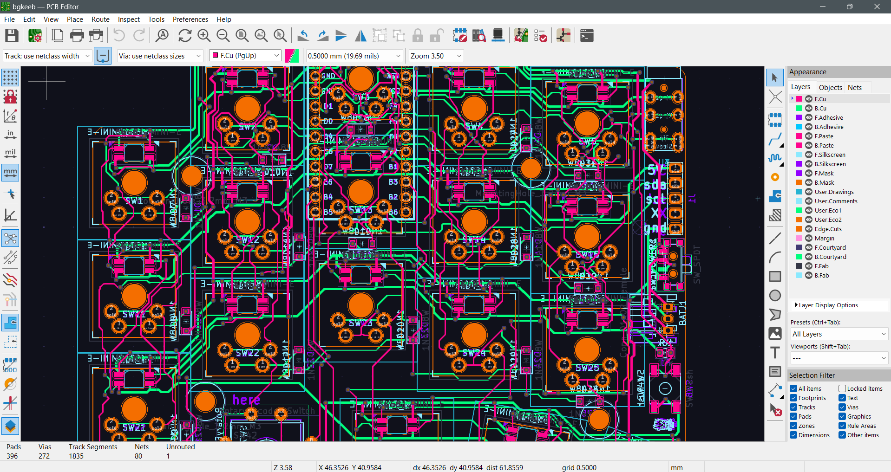
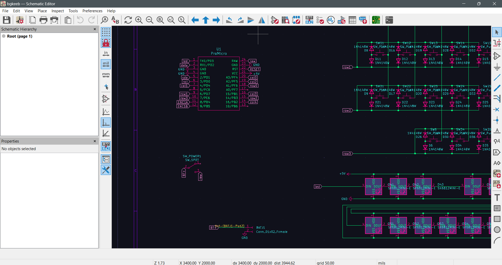
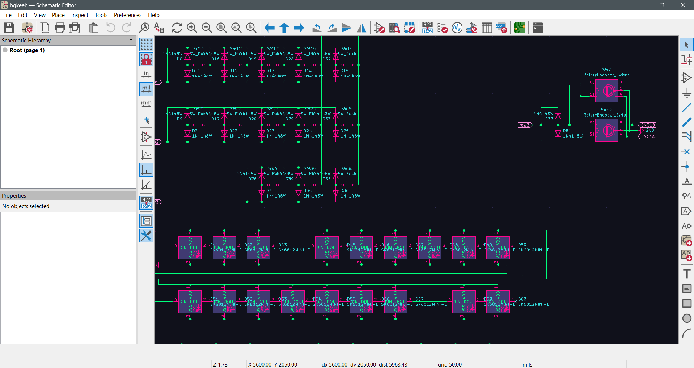

# Blossom Theme for KiCad

## Preview

## Installation

1. **Locate your KiCad configuration directory:**
   - **Windows:** `C:\Users\[YourUsername]\AppData\Roaming\kicad\7.0\colors\` (or `%APPDATA%\kicad\7.0\colors`) 
   - **Linux:** `~/.config/kicad/7.0/colors/` 
   - **macOS:** `~/Library/Preferences/kicad/7.0/colors/` 

2. **Create the colors folder if it doesn't exist:**
   - If the `colors` directory is not present in your KiCad 7.0 configuration folder, create it manually.

3. **Copy the theme JSON file:**
   - Place your `.json` theme file into the `colors` folder you located or created in step 1.
   - The file name (without the `.json` extension) will be the name that appears in KiCad's theme list.

4. **Restart KiCad:**
   - Close all KiCad windows completely and reopen the application to ensure the new theme is detected.

5. **Select the new theme in each editor:**
   - Open the **Schematic Editor**, go to **Preferences** → **Preferences** → **Schematic Editor** → **Colors**
   - In the "Theme" dropdown menu, select your newly installed theme and click **OK** or **Apply**
   - Repeat this process for other editors:
     - **PCB Editor:** **Preferences** → **Preferences** → **PCB Editor** → **Colors**
     - **Symbol Editor:** **Preferences** → **Preferences** → **Symbol Editor** → **Colors**
     - **Footprint Editor:** **Preferences** → **Preferences** → **Footprint Editor** → **Colors**

**Note:** Each KiCad editor (Schematic, Symbol, Board, and Footprint editors) can have its own color theme selected independently.

That's It...
Enjoy!

